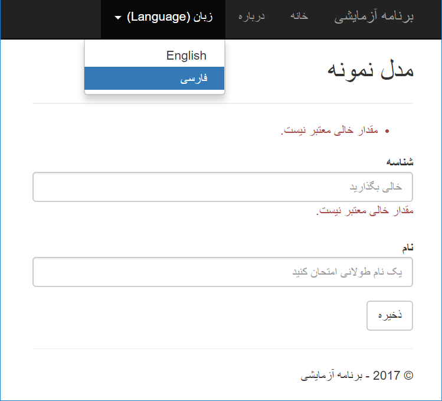

# ASP.NET Core Localization Sample
The example contains localization in these topics:
- Display Attribute localization
- Validation Attributes localization
- Model Binding errors localization
- Using a Shared resource for Views and Controllers
- Allowing user to change culture at run-time
- Applying direction (rtl/ltr) based on the selected culture

The example is ready to run, you can get it and run it to see the result. Based on seleted culture from language menu, you can see localized content and validation messages for application. I've created this example as an additional resource for the answer of this question in stackoverflow: [ASP.NET Core Model Binding Error Messages Localization](http://stackoverflow.com/questions/40828570/asp-net-core-model-binding-error-messages-localization).

### Version
The repository contains two projects for these versions:

- VS 2015, ASP.NET Core 1.1
- VS 2017, ASP.NET Core 2.0 

### Note

You may want to pay attention to these parts of the project for settings:

 - `ConfigureServices` and `Configure` method in *Startup.cs* for localization condigurations. Here we enable localization and also provide localization for framework model binding error messages. Also here we introduce cultures which the application suppports.
 - `_Layout.cshtml` file which we added *Language* menu and localized menu.
 - `_ViewImports.cshtml` and the way we injected a shared localizer to use a `Shared.xx.resx` in all views.
 - `Resources` folder which contains resx files.
 - `SampleModel` class which annotated by data annotations attribute.
 - `SetCulture` action in `Home` controller which we used to set culture.
 - `About.cshtml` and `Index.cshtml` to see the way which we used `SR` which is injected in `_ViewImports`.

